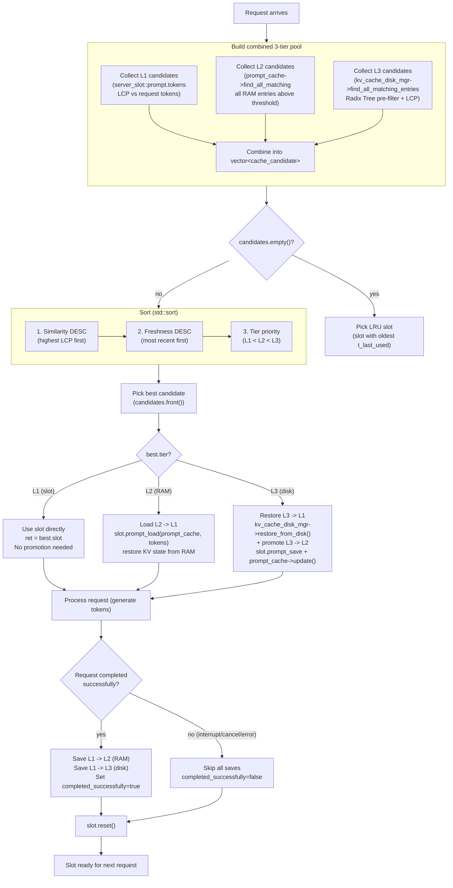
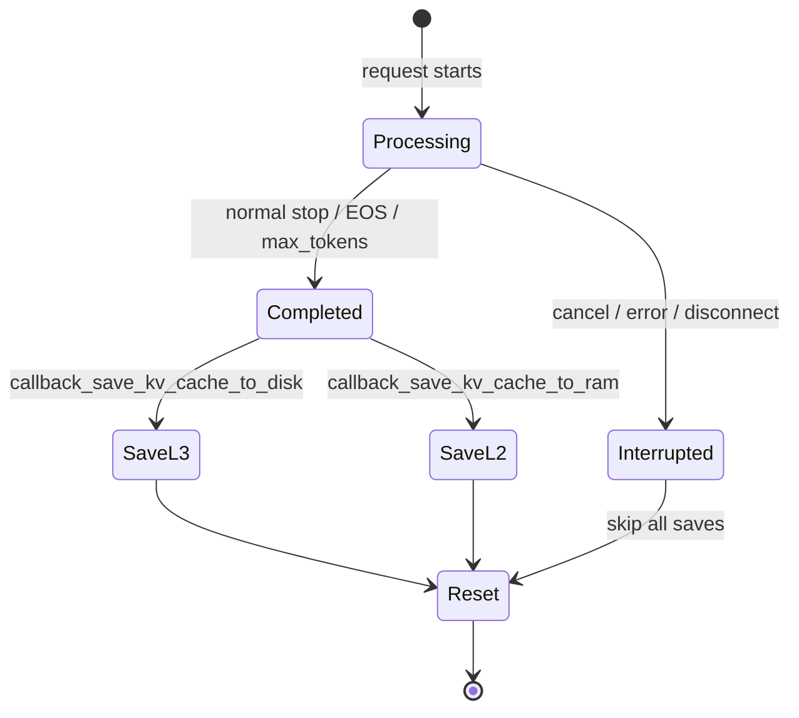
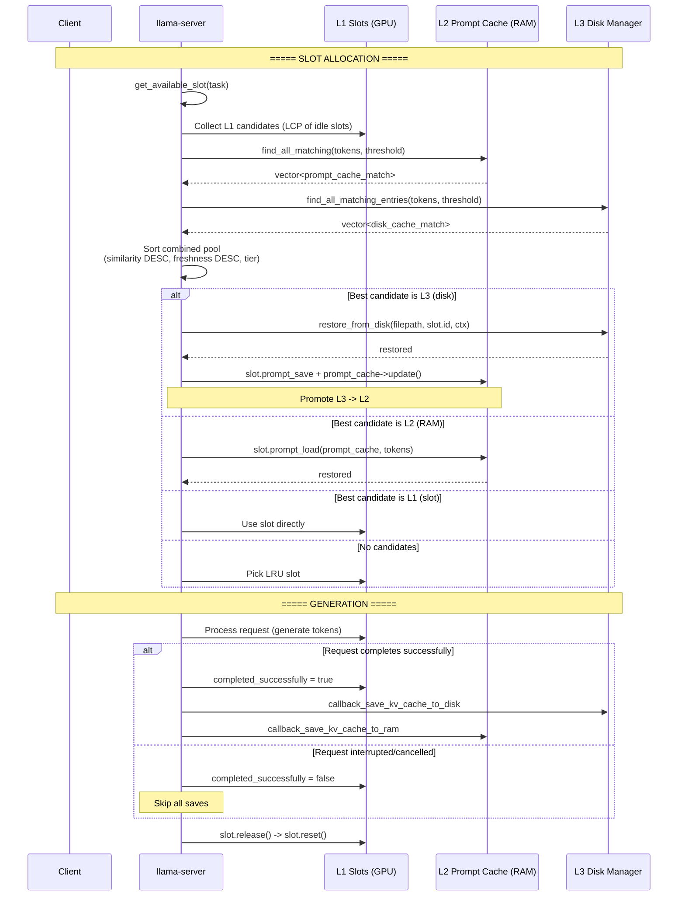

# Automatic KV Cache -- 3-Tier Unified Pool Architecture

## Overview

`llama-server` implements a **unified 3-tier cache pool** for KV cache slot selection. Instead of checking each tier independently (as in the original 2-tier design), all matching entries from **L1 (GPU slots)**, **L2 (RAM prompt cache)**, and **L3 (disk cache)** are collected into a single sorted array. The best candidate is selected by a composite sort order and promoted according to tier rules. Saves to L2 and L3 occur only on **successful completion**; interrupted/cancelled requests skip all persistence.

---

## Architecture Diagram (Full Lifecycle)



---

## Tier Details

### L1 -- GPU Slots (`server_slot`)

| Property | Detail |
|---|---|
| Storage | In-GPU KV cache (`llama_context`) |
| Identification | `slot.prompt.tokens` -- currently loaded prompt |
| Lifetime | Per-slot, reset on `slot.release()` |
| Matching | `tokens.get_common_prefix(task.tokens) / task.tokens.size()` |
| Freshness | `slot.t_last_used` (microseconds) |
| Selection | Direct assignment: `ret = best.slot` |

### L2 -- RAM Prompt Cache (`server_prompt_cache`)

| Property | Detail |
|---|---|
| Storage | In-memory ring buffer of `server_prompt` states |
| Identification | `state.tokens` -- cached token sequence |
| Lifetime | Until evicted (managed by `--cache-ram` size limit) |
| Matching | `find_all_matching(tokens_new, threshold)` -- iterates all states |
| Freshness | `state.created_us` (microseconds, set at `alloc()`) |
| Selection | `slot.prompt_load(*prompt_cache, task.tokens)` -- restores KV from RAM |

**`find_all_matching()` output:**

```cpp
struct prompt_cache_match {
    float   similarity;      // LCP ratio
    int64_t timestamp_us;    // created_us for freshness
};
```

### L3 -- Disk Cache (`kv_cache_disk_manager`)

| Property | Detail |
|---|---|
| Storage | Serialized KV state files on disk (`kv-cache-manager/`) |
| Identification | `slot_<seq_id>_<timestamp>.bin` + Radix Tree metadata |
| Lifetime | Until evicted (TTL or size-based LRU) |
| Matching | `find_all_matching_entries(tokens, threshold)` -- Radix Tree + LCP |
| Freshness | `metadata.created_at_us` (microseconds) |
| Selection | `kv_cache_disk_mgr->restore_from_disk(filepath, slot.id, ctx_tgt)` |

**`find_all_matching_entries()` output:**

```cpp
struct disk_cache_match {
    std::string filepath;       // Path to serialized file
    float       similarity;     // LCP ratio
    int64_t     timestamp_us;   // created_at_us for freshness
};
```

---

## Pool Building & Sorting

### Entry Point

`server_context_impl::get_available_slot()` (line 1631 of `server-context.cpp`)

### Candidate Collection

```cpp
struct cache_candidate {
    enum tier_t { TIER_L1_SLOT, TIER_L2_RAM, TIER_L3_DISK };

    tier_t        tier;
    float         similarity;   // LCP similarity to request tokens
    int64_t       freshness;    // higher = more recent
    server_slot * slot;         // L1 only
    std::string   filepath;     // L3 only
};
```

**Collection pseudocode:**

1. **L1**: Iterate idle slots, compute `get_common_prefix` ratio, push if above `slot_prompt_similarity` threshold
2. **L2**: Call `prompt_cache->find_all_matching(tokens, threshold)`, push all results
3. **L3**: Call `kv_cache_disk_mgr->find_all_matching_entries(tokens, threshold)`, push all results

### Sort Comparator

```cpp
std::sort(candidates.begin(), candidates.end(),
    [](const cache_candidate & a, const cache_candidate & b) {
        // 1. Similarity DESC
        if (std::abs(a.similarity - b.similarity) > 1e-6f)
            return a.similarity > b.similarity;
        // 2. Freshness DESC
        if (a.freshness != b.freshness)
            return a.freshness > b.freshness;
        // 3. Tier priority (L1 < L2 < L3 in enum order)
        return a.tier < b.tier;
    });
```

### Promotion Rules

| Best Tier | Action |
|---|---|
| **L1** (slot) | Use directly. KV already in GPU. No promotion needed. |
| **L2** (RAM) | `slot.prompt_load(*prompt_cache, tokens)` -- restore KV from RAM to GPU slot. |
| **L3** (disk) | 1. `kv_cache_disk_mgr->restore_from_disk(filepath, slot.id, ctx)` -- file -> GPU KV 2. `slot.prompt_save(*prompt_cache)` + `prompt_cache->update()` -- promote L3->L2 |

No candidate from any tier falls through to **LRU** (oldest `t_last_used`).

---

## Conditional Save Protocol

### The `completed_successfully` Gate



### Where `completed_successfully` is Set

| Path | Location (server-context.cpp) |
|---|---|
| Embedding task complete | line 3935 |
| Rerank task complete | line 3943 |
| Text generation stop (non-spec) | line 4008 |
| Text generation stop (speculative) | line 4136 |
| On `reset()` | cleared to `false` (line 308) |

### Save Callbacks (Installed at `load_model()`)

**L3 (disk) callback** (line 1401):
```cpp
slot.callback_save_kv_cache_to_disk = [this, &slot]() {
    if (!kv_cache_disk_mgr || !slot.ctx_tgt) return;
    if (slot.task_tokens_original.empty()) return;
    kv_cache_disk_mgr->save_to_disk(slot.id, slot.ctx_tgt, slot.ctx_dft,
                                    slot.task_tokens_original.data(),
                                    slot.task_tokens_original.size());
};
```

**L2 (RAM) callback** (line 1412):
```cpp
slot.callback_save_kv_cache_to_ram = [this, &slot]() {
    if (!prompt_cache || !slot.ctx_tgt) return;
    slot.prompt_save(*prompt_cache);
    prompt_cache->update();
};
```

### Release Flow

```
slot.release()
  |
  +-- completed_successfully == true?
  |     YES: callback_save_kv_cache_to_disk() (L3)
  |          callback_save_kv_cache_to_ram()   (L2)
  |     NO:  log "skipping cache save"
  |
  +-- reset()  (clears completed_successfully, task, tokens, etc.)
  +-- callback_on_release(id_slot)
```

---

## Data Structure Relationships

```mermaid
classDiagram
    class server_context_impl {
        +vector<server_slot> slots
        +unique_ptr<server_prompt_cache> prompt_cache
        +unique_ptr<kv_cache_disk_manager> kv_cache_disk_mgr
        +get_available_slot(task) server_slot*
    }

    class server_slot {
        +server_prompt prompt
        +vector<llama_token> task_tokens_original
        +bool completed_successfully
        +function callback_save_kv_cache_to_disk
        +function callback_save_kv_cache_to_ram
        +int64_t t_last_used
        +prompt_save(prompt_cache) bool
        +release()
        +reset()
    }

    class server_prompt_cache {
        +find_all_matching(tokens, threshold) vector<prompt_cache_match>
        +load(prompt, tokens, ctx, slot) bool
        +alloc(prompt, state_size, state_size_dft) server_prompt*
        +update()
    }

    class kv_cache_disk_manager {
        +find_all_matching_entries(tokens, threshold) vector<disk_cache_match>
        +restore_from_disk(filepath, slot_id, ctx) bool
        +save_to_disk(slot_id, ctx_tgt, ctx_dft, tokens, count) bool
        +evict_expired_entries()
        +find_cache_entry(tokens, threshold) string
    }

    class cache_candidate {
        +enum tier_t { TIER_L1_SLOT, TIER_L2_RAM, TIER_L3_DISK }
        +tier_t tier
        +float similarity
        +int64_t freshness
        +server_slot* slot
        +string filepath
    }

    server_context_impl "1" --> "*" server_slot
    server_context_impl "1" --> "0..1" server_prompt_cache
    server_context_impl "1" --> "0..1" kv_cache_disk_manager
    server_slot "1" --> "1" server_prompt : contains

    note for cache_candidate "Temporary struct per get_available_slot() call"

    server_context_impl ..> cache_candidate : builds pool in
    cache_candidate ..> server_slot : references (L1 only)
    cache_candidate ..> kv_cache_disk_manager : filepath from (L3 only)
    cache_candidate ..> server_prompt_cache : similarity from (L2 only)
```

---

## Lifecycle Sequence (Full Request)



---

## Key Design Decisions

| Decision | Rationale |
|---|---|
| **Combined pool** over sequential tier checks | Enables true cross-tier comparison (e.g., L3 with similarity 0.9 beats L2 with 0.7) |
| **Sort: similarity > freshness > tier** | Best semantic match first; recency breaks ties; L1 preferred when equal |
| **L3 -> L2 promotion** on restore | Avoids re-reading disk if same prompt arrives again |
| **`completed_successfully` gate** | Prevents saving partial/corrupted KV state on interrupts / errors |
| **`task_tokens_original`** preserved until `reset()` | Captures prompt tokens at task start (before truncation) for accurate disk save |
| **Save callbacks before `reset()`** in `release()` | Preserves `task_tokens_original` and prompt KV state for serialization |
| **Radix Tree for L3 search** | O(m log k) prefix matching -- 100-10000x faster than linear scan at scale |
| **L2 threshold reused for L1 and L2** | Single `slot_prompt_similarity` configures all three tiers consistently |

---

## CLI Integration

```bash
# Enable full 3-tier KV cache (requires --slot-save-path)
./build/bin/llama-server \
    -m model.gguf \
    --port 8080 \
    --slot-save-path /data/slots \
    --kv-cache-auto \
    --cache-ram 1024 \      # L2 RAM prompt cache size (MiB)
    --max-cache-size 2 \    # L3 disk cache limit (GB)
    --cache-ttl 7200        # L3 entry TTL (seconds)
```

### Parameter Mapping

| Flag | Tiers Affected | Default | Description |
|---|---|---|---|
| `--kv-cache-auto` | L3 (disk) | disabled | Enable automatic disk cache |
| `--slot-save-path` | L3 (disk) | (empty) | Cache directory (required for L3) |
| `--cache-ram N` | L2 (RAM) | varies | RAM prompt cache in MiB; 0 = disabled |
| `--slot-prompt-similarity` | L1+L2+L3 | varies | LCP threshold for all 3 tiers |
| `--max-cache-size N` | L3 (disk) | 8.0 GB | Max disk cache size |
| `--cache-ttl N` | L3 (disk) | 3600 s | Entry TTL on disk |

---

## Security & Constraints

1. **Disabled by default** -- requires explicit `--kv-cache-auto` flag
2. **Directory validation** -- ensures cache path is a valid directory
3. **Size limits** -- `--max-cache-size` prevents disk exhaustion
4. **TTL enforcement** -- automatically cleans up stale disk entries
5. **Conditional save** -- `completed_successfully` prevents partial state persistence
6. **Orphaned file reconciliation** -- cleaned up on startup
7. **All operations synchronous and bounded** -- no external I/O loops

---

## Related Documents

| File | Content |
|---|---|
| `kv-cache-auto-prompt.md` | Original design specification |
| `kv-cache-auto-integration.md` | Integration guide (legacy 2-tier flow) |
| `kv-cache-auto-similarity-sorting.md` | LCP computation and Radix Tree details |
| `kv-cache-auto-final-plan.md` | Implementation reference with code snippets |
| `kv-cache-auto-testing.md` | Testing guide and C++/Python tests |
